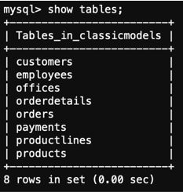
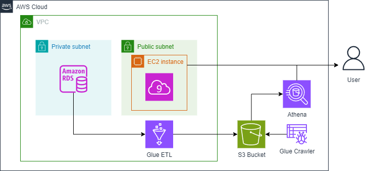
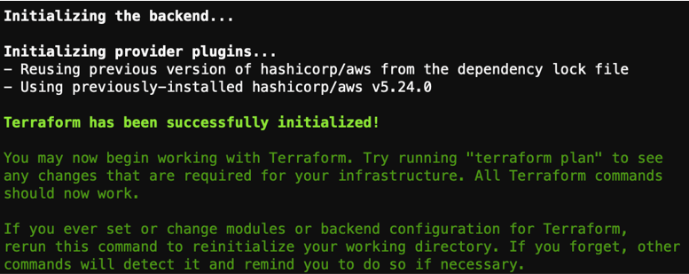
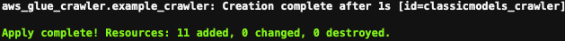
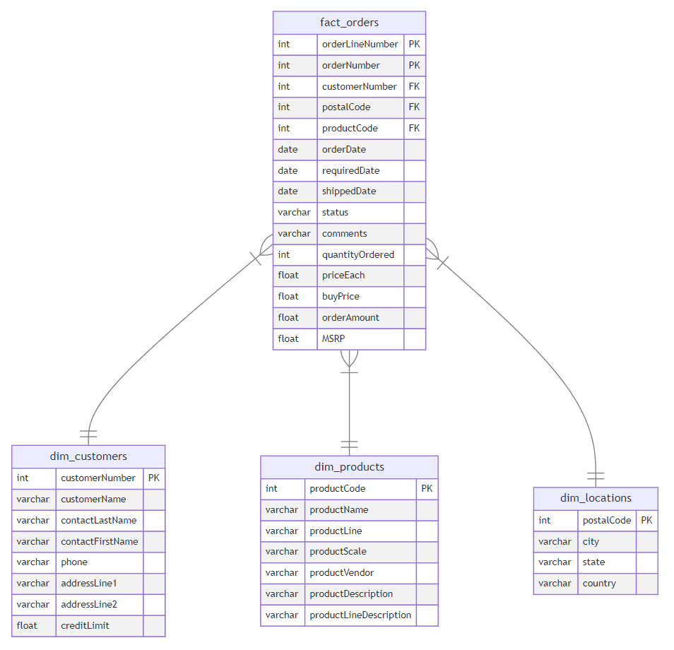

# Week 2 Assignment:<br>An Example of the Data Engineering Lifecycle

In this lab, you will set up and run a data pipeline example that shows all the 
stages of the data engineering lifecycle. Your source system will be a 
relational database instantiated as MySQL database in Amazon RDS 
(Relational Database Service). You will first explore the source database with 
a sample dataset, then use AWS Glue to extract, transform, and load (ETL) the 
data in your data pipeline, storing it in the AWS object storage Amazon S3. 
You will finally query the stored data using Amazon Athena to build a data 
visualization dashboard in Jupyter Lab. To define and configure the components 
of this data pipeline example, you will use Terraform as Infrastructure as Code
(IaC) service.


## 1 - Introduction

Assume you work as a Data Engineer at a retailer of scale models of classic 
cars and other transport. The retailer stores its historical purchases and its 
customers' information in a relational database that consists of the following 
tables: customers, products, productlines, orders, orderdetails, payments, 
employees, offices. In this lab, you will use an example of such a database: 
[MySQL Sample Database](https://www.mysqltutorial.org/mysql-sample-database.aspx)

The data analyst of the marketing team is interested in analyzing the historical 
purchases to understand for example which product line is more successful and 
how the sales are distributed across the countries. While the data analyst can 
directly query the data from the relational database, they might need to write 
complex queries that might take a long time to retrieve the required data. 
Performing analytical queries on production application databases mostly is a bad 
idea, because it might impact that database's performance. Your 
job as a Data Engineer is to build a data pipeline that transforms the data 
into a form that is easier to understand and faster to query, and serve it to 
the data analyst so that they can just focus on the analytical efforts.

In this lab, you will explore an end-to-end example that shows the 
implementation of the stages of the data engineering lifecycle on AWS, and 
familiarize yourself with the lab environment. 

Let's first start with exploring the source system!

## 2 - Exploring the Source System

As a Data Engineer, you usually do not maintain or create the source systems 
because they are out of your control. Your job is to build the data pipeline 
that ingests and combines data from the source systems. In this lab, 
you are provided with a MySQL database that represents the source system 
you will interact with. The given database contains the tables that we listed 
in the previous section, and it is instantiated using Amazon RDS, which is a 
managed service that allows you to run relational databases in the cloud.
Before you run the data pipeline, you will quickly explore this database.

2.1. To connect to the Amazon RDS MySQL instance, you need to get its endpoint. 
An endpoint is the URL of the entry point for the AWS web service. 
Get the endpoint of the database instance with the following command 
(replace the `<MySQL-DB-name>` with `de-c1w2-rds`).

``` bash
aws rds describe-db-instances --db-instance-identifier <MySQL-DB-name> --output text --query "DBInstances[].Endpoint.Address"
```

2.2. Now connect to the database by running the following command, replacing
- `<MySQLEndpoint>` with the output from the previous step,

- `<DatabaseUserName>` with `admin`,

- `<Password>` with `adminpwrd`:

``` bash
mysql --host=<MySQLEndpoint> --user=<DatabaseUserName> --password=<Password> --port=3306
```

2.3. After you have established the connection to the RDS instance, you can check 
the database labeled as `classicmodels`, and verify the tables it contains by running 
the following commands:

``` bash
use classicmodels;
show tables;
```

You should get an output similar to this one:



The script used to populate the database can be found in 
*data/mysqlsampledatabase.sql*. Check this file, and try to identify some of 
the commands. Don't worry if you don't understand all the statements - you 
will get a better understanding of this language in future labs. As 
mentioned before, the database is already populated for you so you do not 
have to modify or execute this file.

2.4. Enter `exit` in the terminal to quit the database connection.

``` bash
exit
```

## 3 - Architecture of the Data Pipeline

Here's the proposed architecture of the data pipeline. This architecture can 
serve as a solution to the problem introduced in this lab. It extracts the 
data from the RDS MySQL database instance and uses AWS Glue to transform and 
store the data into an S3 bucket (object storage instance), making it queryable 
for the data analyst through Amazon Athena.



Here is a brief description of the components:

- **Source Database:** You already interacted with the source database in the 
    previous section. This is a relational database that hosts structured 
    and normalized tables. More specifically, it represents an Online Transaction 
    Processing (OLTP) system that stores transactional data, where a transaction
    in this lab represents a sale order placed by a customer.

- **Extraction, Transformation & Load (ETL):** The second component is 
    [AWS Glue](https://aws.amazon.com/en/glue/).

  - **Extraction:** This step involves extracting data from the OLTP database.
    An AWS Glue Job is used to connect to the RDS database and retrieve data.

  - **Transformation:** After extracting the data, Glue performs data transformation. 
    You can specify for Glue what type of transformation you'd like to perform on 
    the extracted data. For this lab, the transformation consists of modeling the 
    data into a star schema, which differs from that in the source database. The star 
    schema is a form that makes the data more readable and easier to use for the data 
    analyst, and it simplifies them writing the queries to extract the data needed 
    for their analysis. Converting the data into a star schema may include tasks 
    such as denormalization, aggregations, and any necessary data cleaning or enrichment.

  - **Load:** This step involves storing the transformed data in a storage system. 
    The storage system chosen in this lab is the AWS object storage solution: 
    [Amazon S3](https://aws.amazon.com/en/s3/). S3 is a scalable and cost-effective 
    storage solution that can be part of the more abstracted storage systems such as 
    data lakes and data warehousing. The transformed data is stored in a format 
    called Parquet that is optimized for analytical usage.

- **Serving layer:** [Amazon Athena](https://aws.amazon.com/en/athena/), a query 
    service, is used to query the data stored in an S3 bucket. It enables SQL-like 
    queries without needing to extract the data from S3 and load it into a traditional 
    database. Users (in this case the data analyst) can run ad-hoc queries for 
    analytics and reporting purposes.


EC2 is needed for Cloud9 to provide a virtual machine (EC2 instance) that hosts 
the Cloud9 IDE, which you are using right now. 

## 4 - Extracting, Transforming and Loading Data

Now that you have an understanding of the different components of your data 
architecture, you will first set up the data pipeline and then run the different 
stages of it. You need to declare and configure the different components of your 
data pipeline. To do so, you will use [Terraform](https://www.terraform.io/), 
which is one of the most popular Infrastructures as Code (IaC) tools developed 
by HashiCorp. It allows users to define and provision infrastructure using a 
declarative configuration language (declarative means that users only need to 
describe the components of the data pipeline without instructing on the detailed 
steps needed to build the data pipeline). Terraform supports cloud providers and 
can also manage on-premises infrastructure.

4.1. Check the contents of the directory *infrastructure/terraform*. 
In that directory, you will find some files with the `tf` extension. 
Those files define the configurations for the resources needed for your data 
architecture. Resources are separated in different scripts just for readability 
which means you won't necessarily find the same file structure in all projects 
that use Terraform for IaC. Try to get an overview of the resources used, 
but do not worry if you do not understand the code and all of the components 
at this stage.

4.2. The `tf` files you checked allow you to declare the resources of your data 
architecture. You still need to specify for AWS Glue how to perform data 
extraction, transformation, and load. You can check all of these steps as Python 
script [infrastructure/terraform/assets/glue_job.py](infrastructure/terraform/assets/glue_job.py). 
Again, you do not need to worry about the details. Let's now put these steps into action!

4.3. In the terminal, navigate to the terraform directory by running the command:

``` bash
cd infrastructure/terraform
```

4.4. The configuration is parametrized to receive some input values from the database 
instance that is running. The parameters of the configuration can be found in the `~/.bashrc` file of your environment. They are defined as environment variables with the prefix `TF_VAR_`. Those were already defined when you executed the `setup.sh` command when you started your Cloud9 environment.


4.5. Initialize the Terraform configuration with the required providers:

``` bash
terraform init
```

You should get an output similar to this one:



4.6. Generate the Terraform plan which lets you preview the changes to infrastructure 
before applying them. When you run the corresponding command, Terraform analyzes 
configuration files to check the desired state, compares the desired state with 
the current infrastructure state, and calculates actions needed to achieve it. 
Run the the following command to generate the plan:


``` bash
terraform plan
```

You will get a summary of planned changes indicating resources to be added, 
modified, or deleted. If it fails to run, check that you have assigned 
correctly the input variables in the previous step.

4.7. Go to previously opened AWS console tab in your browser, search for *Glue* and open 
*AWS Glue*. Enter *ETL jobs* on the left side of the dashboard. 
You should see there are no jobs defined yet.

4.8. Apply the configuration by running:

``` bash
terraform apply
```

It will show you the same plan generated before and prompt you to reply `yes`:


4.9. Check the progress of the deployment through the terminal. 
Terraform will create some resources in your AWS account. Once it finishes, you 
will receive a confirmation similar to this:



4.10. Go back into the AWS Glue console and enter in the *ETL jobs* link.
Now you will see a job created with the name `de-c1w2-etl-job` that you have just created with IaC!

4.11. Start the AWS Glue job:

``` bash
aws glue start-job-run --job-name de-c1w2-etl-job | jq -r '.JobRunId'
```

You should get `JobRunID` in the output.

4.12. Check the status of the AWS Glue job exchanging the `<JobRunID>` with the 
output from the previous step:

``` bash
aws glue get-job-run --job-name de-c1w2-etl-job --run-id <JobRunID> --output text --query "JobRun.JobRunState"
```

You can also see the job status in the console by opening the `de-c1w2-etl-job` 
and going to the tab `Runs`. Wait until the job status changes to 
`SUCCEEDED` (it will take 2-3 min).


The Glue job transformed the data, transitioning it from 
[original schema](https://www.mysqltutorial.org/mysql-sample-database.aspx) to another:



This new data form is known as the star schema. It consists of fact and 
dimension tables. The fact_orders table represents the measurements that 
resulted from a business event. In this example, each row in the fact table 
corresponds to a sale order and contains related measurements such as 
quantity ordered and price. The dimension tables provide more context for 
the measurements of the fact table. In this example, the dimension tables 
provide more information related to customers, customers' locations, and 
order details. How does this form ease the job for data analysts? The fact 
table contains the measurements that they need to aggregate (total of sales, 
average of prices, ... ) and the dimension tables help make these aggregations more 
specific (total of sales done in a given country, maximum number of quantities 
ordered for each product line). This could be done by writing simple query 
statements, that could have been more complicated if done on the original table. 
You will learn more about data modeling in Course 4 of this specialization.

## 5 - Data Insights and Visualizations

Your role as a Data Engineer might finish here. All of what you need to do now
is to give the data analyst access to the data stored in S3 so that they can 
query it using Amazon Athena. For this lab, you will also experiment with this 
last step which is to query the data using Amazon Athena and create some 
visualizations to analyze the data. You will carry out the analysis in Jupyter Notebook.

5.1. Go back to the tab where you have the Jupyter Lab environment. Go inside the `infrastructure/jupyterlab` folder.

5.2. Open the notebook *C1_W2_Dashboard.ipynb* and follow the 
instructions there.
