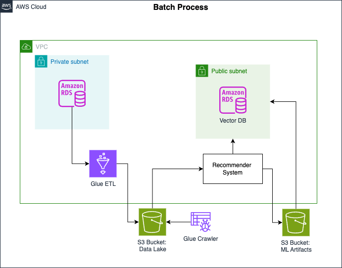
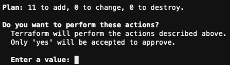
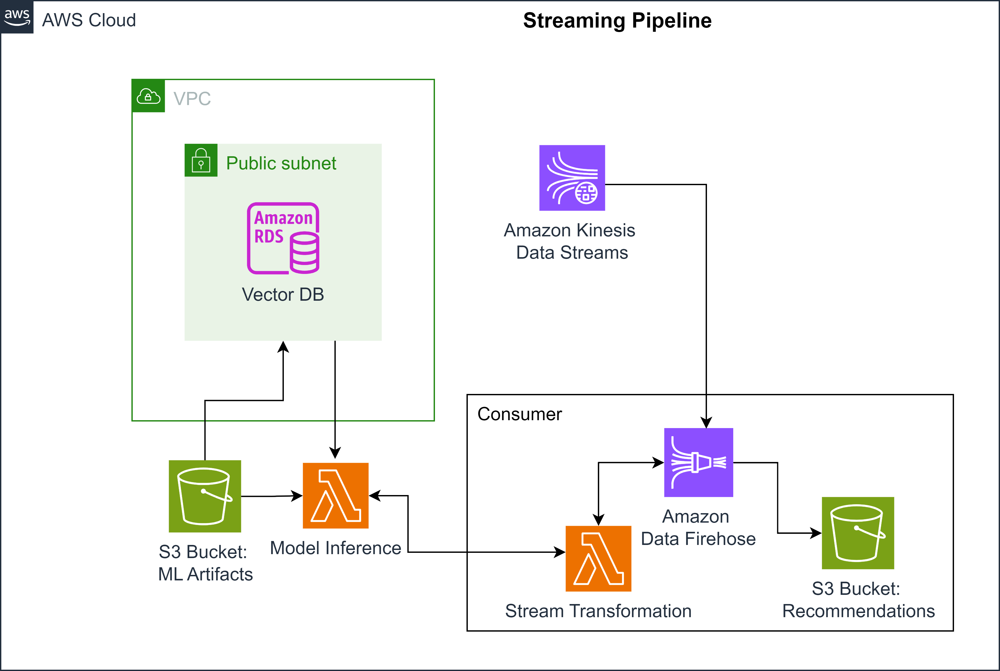

# Week 4 Assignment:<br>Building End-to-End Batch and Streaming Pipelines<br>Based on Stakeholder Requirements

In this lab, you will experiment one step further with the framework of "Thinking like a Data Engineer". 
You will implement the batch and streaming architectures that you've explored in the quizzes this week 
to meet the stakeholder requirements. You will first start with implementing the batch pipeline that serves 
the training data for the recommender system. You will then store the output embeddings of the model in 
a vector database, and finally implement the streaming pipeline that uses the trained model and the vector 
database to provide real-time product recommendations.

## 1 - Implementing the Batch Pipeline

Here's the architectural diagram of the batch pipeline:



The batch pipeline ingests product and user data from the source database (Amazon RDS MySQL database), 
transforms it using AWS Glue ETL and stores the transformed data in an Amazon S3 bucket. 
The data is transformed into training data that will be used by the data scientist to train the recommender system. 

Before you implement this pipeline, you will explore an additional table that was added to the 
`classicmodels` [MySQL Sample Database](https://www.mysqltutorial.org/mysql-sample-database.aspx) 
used in Week 2. The additional table is labeled `ratings` and consists of the ratings assigned 
by the users to products they have bought. The ratings are on a scale between 1 to 5 
and were generated for this lab. 

**Exploring the `ratings` table**

The source database (Amazon RDS MySQL database) is already instantiated and 
provisioned for you to use in this lab. Let's connect to it and check the `ratings` table.
 
1.1. Get the endpoint (i.e., address) of the database instance with the following command
    (replace the `<MySQL-DB-name>` with `de-c1w4-rds`):

```bash
aws rds describe-db-instances --db-instance-identifier <MySQL-DB-name> --output text --query "DBInstances[].Endpoint.Address"
```


1.2. Connect to the database by running the following command, replacing
   - `<MySQLEndpoint>` with the output from the previous step,

   - `<DatabaseUserName>` with `admin`,

   - `<Password>` with `adminpwrd`:

```bash
mysql --host=<MySQLEndpoint> --user=<DatabaseUserName> --password=<Password> --port=3306
```

1.3. Make sure to use the `classicmodels` database and list the existing tables: 

```bash
use classicmodels;
show tables;
```

You should see the new table: `ratings`. 

1.4. To check the first 20 lines of the table, run the following query:

```sql
SELECT * 
FROM ratings
LIMIT 20;
```

The `LIMIT` clause limits the number of rows displayed in the query result, 
you can adjust this number to see more or less data.
    
Try to understand the structure of the `ratings` table and where it should be placed in the original 
[schema](https://www.mysqltutorial.org/getting-started-with-mysql/mysql-sample-database/). 
    
1.5. Quit the connection to the database:

```bash
exit
```

**Running AWS Glue ETL Job**
        
You will now create the resources needed for the batch pipeline (AWS Glue ETL and 
Amazon S3 bucket) using [Terraform](https://www.terraform.io/). Remember that Terraform is an Infrastructures as Code (IaC) 
tool that allows you to configure and provision resources for your workflow. 
Once you create the resources, you will run the AWS Glue Job that will ingest 
the data from RDS and transform it into the training data requested by the data scientist.

1.6. Setup the environment running the script `scripts/setup.sh`:

```bash
source ./scripts/setup.sh
```

This script installs the necessary packages (PostgreSQL and Terraform) and sets up some environment variables required to pass parameters into the Terraform configuration.


1.7. Go to the `terraform` folder. 

```bash
cd terraform
```

1.8. Open the terraform script `terraform/main.tf`. 
For the part of the batch pipeline, you only have to work on `module "etl"`. 
Uncomment the corresponding section of the file (lines 1 to 13), keeping the 
rest of the file commented (comments in Terraform start with `#`).

*Note*: Remember to save your changes by pressing `Ctrl+S` or `Cmd+S`.

1.9. Open the script `terraform/outputs.tf` and uncomment the lines
corresponding to the `ETL` section (lines 2 to 8).

*Note*: Remember to save your changes by pressing `Ctrl+S` or `Cmd+S`.

1.10. Initialize the terraform configuration:

```bash
terraform init
```

1.11. To deploy the resources, run the following commands:

```bash
terraform plan
terraform apply
```

*Note*: The command `terraform apply` will prompt you to reply `yes` here:



1.12. Now that your resources are available, and have been created, go back to the AWS console, search for AWS Glue, and 
enter the **ETL jobs** link on the left panel. You should see a job created 
with the name `de-c1w4-etl-job`. 

1.13. Start the AWS Glue job:

```bash
aws glue start-job-run --job-name de-c1w4-etl-job | jq -r '.JobRunId'
```

You should get `JobRunID` in the output. 
   
1.14. Check the status of the AWS Glue job exchanging the `<JobRunID>` with the output from the previous step:

```bash
aws glue get-job-run --job-name de-c1w4-etl-job --run-id <JobRunID> --output text --query "JobRun.JobRunState"
```

You can also see the job status in the console by opening the `de-c1w4-etl-job`
and going to the tab `Runs`. Wait until the job status changes to 
`SUCCEEDED` (it will take 2-3 min).

The transformed data has the following schema:    


1.15. The AWS Glue Job should transform the data and store it in the data lake S3 
bucket that was created with IaC. You can go to the AWS console, search for **S3**
and then search for a bucket named `de-c1w4-<PLACEHOLDER>-datalake`. 
Under the folder `ratings-ml-training` you can see some additional 
folders with the naming convention: `customerNumber=<NUMBER>`. This convention 
indicates how the data was partitioned during the storage step. 
The concept of partitioning will be tackled later in the specialization.

Once the data is there, the ML Team will take this data and train their model.

## 2 - Creating & Setting up the Vector Database

2.1. Now, let's suppose the Data Scientist has trained the model. They created the S3 bucket
called `de-c1w4-<AWS-ACCOUNT-ID>-us-east-1-ml-artifacts`. In that bucket, the Data Scientist 
published the results of the model. You can explore the bucket and find the following 
folder structure:

```bash
.
├── embeddings/
|   ├── item_embeddings.csv
|   └── user_embeddings.csv
├── model/
|   └── best_model.pth   
└── scalers/
    ├── item_ohe.pkl
    ├── item_std_scaler.pkl
    ├── user_ohe.pkl
    └── user_std_scaler.pkl   
```

The `embeddings` folder contains the embeddings of the users and items (or products) that
were generated in the model. 

The `model` folder contains the trained model that will be used for inference.

The `scalers` folder contains the objects used on the preprocessing part for 
the training, such as 
[One Hot Encoders](https://hackernoon.com/what-is-one-hot-encoding-why-and-when-do-you-have-to-use-it-e3c6186d008f) 
and [Standard Scalers](https://en.wikipedia.org/wiki/Feature_scaling).

The Data Scientist asked to upload the `item_embeddings.csv` and `user_embeddings.csv` 
files into a Vector Database (Vector DB). Those embeddings will be used by the 
recommender system in the streaming pipeline to provide product recommendations. 
The use of a vector database accelerates the retrieval of items that are similar to a 
given item. So for example, if a user places an item in the cart, the recommender 
model will first compute the embedding vector of this item and then use the vector 
database to retrieve similar items to it. 

**Creating the vector database**

For the vector database, you will create with Terraform an RDS PostgreSQL database 
with the `pgvector` [extension](https://github.com/pgvector/pgvector). The PostgreSQL 
database is typically faster for complex queries and data analysis, while MySQL, 
which you used previously, is more efficient for simpler queries. Working with Vector 
DB PostgreSQL provides more capabilities and flexibility.

2.2. In the Cloud9 environment, open again the `/terraform/main.tf`
script. Uncomment the `module "vector_db"` section (lines 15 to 25). 

*Note*: Remember to save your changes by pressing `Ctrl+S` or `Cmd+S`.

2.3. In the file `/terraform/outputs.tf`, uncomment the blocks 
associated with the Vector DB (lines 11 to 27). 

*Note*: Remember to save your changes by pressing `Ctrl+S` or `Cmd+S`.

2.4. Re-initialize the terraform module, plan and apply changes with the following commands:


```bash
terraform init
terraform plan
terraform apply
```

*Note*: The command `terraform apply` will prompt you to reply `yes` here:


*Creation of the database will take around 7 minutes*.
    
2.5. You will see that some information is displayed after the `terraform apply` 
command, but some fields (database username and password) appear as sensitive. In order to see that information, 
which will be used to connect to the Vector DB, you need to use the following commands: 

```bash
terraform output vector_db_master_username
terraform output vector_db_master_password
```

Save the outputs somewhere locally - you will use them later.

*Note*: The outputs are printed in double quotes, which are not part of the username or password.

**Adding the embeddings to the vector database**

Now that the vector database has been created, you will connect to it to import 
the embeddings from S3. The `sql/embeddings.sql` file contains the SQL statements for this task. 

2.6. Open the `sql/embeddings.sql` file and change the bucket placeholders `<BUCKET_NAME>` 
with the `de-c1w4-<AWS-ACCOUNT-ID>-us-east-1-ml-artifacts` bucket name 
(where `<AWS-ACCOUNT-ID>` is your AWS Account ID). You can go back to step 2.1 
to get the bucket name that contains the embeddings. 

*Note*: The change of the bucket placeholders `<BUCKET_NAME>` should be done in two places!

*Note*: Remember to save your changes by pressing `Ctrl+S` or `Cmd+S`.


2.7. Get the `vector_db_host` output from Terraform (see the instructions in step 2.5).

You will later use this output, so save it somewhere locally.

2.8. Now connect to the database by running the following command, replacing 
`<VectorDBHost>` with the output from the previous step. You will be asked for a password,
you can use the one obtained in step 2.5.

```bash
psql --host=<VectorDBHost> --username=postgres --password --port=5432
```

2.9. Then, to work in the postgres database use this command with the same password:

```bash
\c postgres;
```

2.10. Once connected to the postgres DB, you can now run the SQL statements 
in the script `sql/embeddings.sql`. Use the following command:

```bash
\i '../sql/embeddings.sql'
```

2.11. To check the available tables, use the following command:

```bash
\dt *.*
```
Press the `Q` key to quit the `psql` prompt.

2.12. Quit the `psql` prompt with the command `\q`.

*Optional*: If you're interested in learning more about postgres flags, you can 
check [link](https://hasura.io/blog/top-psql-commands-and-flags-you-need-to-know-postgresql/).

## 3 - Connecting the Deployed Model to the Vector Database

So now you have the vector database created and the embeddings imported inside of it. 
Let's see where it fits into the streaming pipeline. Here's the architectural 
diagram of the streaming workflow:



On the left side, you see a lambda function labeled as "model inference". 
This lambda function, which is a serverless compute resource, will use the trained 
model stored in S3 and the embeddings from the vector database to provide the 
recommendation based on the online user activity streamed by Kinesis Data streams. 

In this section, you will configure the variables in the lambda function to make 
it ready for the streaming pipeline.

3.1. In the AWS Console, search for **RDS**, click on **Databases** in the left panel, 
and find the database called `de-c1w4-vector-db`. Click on it. 

3.2. In the *Connectivity & Security* tab, search for the endpoint, which should 
have the following structure: `de-c1w4-vector-db.xxxxxxxxxxxx.us-east-1.rds.amazonaws.com`. 
Copy this value and keep it safe as you will use it in a moment 
(this is the same endpoint you got with the command `terraform output vector_db_host`). 

3.3. Back to the AWS Console, search for *Lambda*. Then find again the lambda function`de-c1w4-model-inference`. 
Click on the name of the lambda and then, scroll down and search for the `Configuration` tab, 
click on it. Then, open Environment Variables from the left panel and click on `Edit`. 

Put the values for the following variables:
   - `VECTOR_DB_HOST`:  VectorDB endpoint that you copied in the previous step,

   - `VECTOR_DB_PASSWORD`: output value from the command `terraform output vector_db_master_password`,
   
   - `VECTOR_DB_USER`: output value from the command `terraform output vector_db_master_username`.

Click on `Save`.

## 4 - Implementing the Streaming Pipeline

You will now implement the streaming pipeline that consists of Kinesis Data Streams, 
Kinesis Firehose and S3 (recommendation bucket). Assume that AWS Kinesis Data Streams 
receives the online user activity from the sales platform log. It then streams 
this data to Kinesis Data Firehose, which acts as a delivery service that handles 
loading data streams into S3 (recommendation bucket). Before it loads the data into 
S3, it invokes the lambda function (stream transformation) that extracts user and 
product features from the data streams and uses the trained recommender model to find 
the recommendations and finally, it loads the recommendations into S3 recommendation bucket.

Now use Terraform to create Kinesis Firehose, S3 recommendation bucket, and the 
lambda function (stream transformation).

4.1. In the Cloud9 environment, open again the `/terraform/main.tf` script, 
uncomment the `module "streaming_inference"` section (lines 27 to 36). 

*Note*: Remember to save your changes by pressing `Ctrl+S` or `Cmd+S`.

4.2. In the file `/terraform/outputs.tf`, uncomment the blocks associated with the 
streaming inference (lines 29 to 32).

*Note*: Remember to save your changes by pressing `Ctrl+S` or `Cmd+S`.

4.3. Re-initialize the terraform module, plan and apply changes:


```bash
terraform init
terraform plan
terraform apply
```

*Note*: The command `terraform apply` will prompt you to reply `yes`.

4.4.  Now, back in the AWS Console, search for **S3** and click on the recommendation 
bucket that was just created using terraform, called `de-c1w4-<PLACEHOLDER>-recommendations`. 
After some time, the Kinesis delivery stream that you created with Firehose will start 
consuming data from the Kinesis data stream `de-c1w4-kinesis-data-stream`. 
Then, it will perform the transformations that you set up in the Lambda function 
and the S3 bucket will be filled with some files. 
You can also go to Lambda and search for `de-c1w4-transformation-lambda` which 
was created with Terraform. Click on it and search the `Monitor` tab. 
Click on `View CloudWatch Logs`. There you will be able to see the logs of the 
function while it performs some transformations. As `de-c1w4-kinesis-data-stream` 
receives data dynamically (with an average time between events of 10 seconds), 
the S3 bucket or the Lambda logs can take some minutes to start showing any data 
or events. You can wait around 5 minutes and refresh the S3/CloudWatch Logs page 
to see the incoming data.
In the S3 bucket, data will be partitioned by date, so you will see a hierarchy of 
directories similar to the following: 

```bash
.
├── year/   
    └── month/
        └── day/
            └── hour/
                └── de-c1w4-delivery-stream-<PLACEHOLDER>
```

In this lab, you went through an end-to-end pipeline for both batch and streaming 
cases. You built a batch data pipeline with AWS Glue and S3 to provide the training 
data for the recommender system, you then created a vector database to store the
embeddings and finally constructed a real-time streaming pipeline using AWS Kinesis 
Data Streams and Firehose. And with that, you've seen how to translate stakeholder 
needs into functional and nonfunctional requirements, choose the appropriate tools 
and then build the data pipeline.
